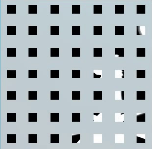

# 一个在系统托盘图标阵列中播放Bad Apple!!的整活

- [一个在系统托盘图标阵列中播放Bad Apple!!的整活](#一个在系统托盘图标阵列中播放bad-apple的整活)
  - [简介](#简介)
  - [要求](#要求)
  - [原理](#原理)
  - [效果预览](#效果预览)
  - [对了](#对了)


## 简介

人们总是热衷于尝试将bad apple在奇怪的地方播放。

[中文维基](https://zh.m.wikipedia.org/zh-hans/Bad_Apple!!)

[哔哩哔哩](https://www.bilibili.com/video/BV1xx411c79H)

[YouTube](https://youtu.be/FtutLA63Cp8)

[有示波器的地方，Bad apple可能会迟到，但从未缺席！](https://www.bilibili.com/video/BV1Et411W743)

[有屏幕的地方就有badapple！—CRT室外全彩拼接大屏像素管聚焦测试](https://www.bilibili.com/video/BV1Zu4y1w7E2/)

## 要求

您需要在NuGet中安装OpenCvSharp4。

- Windows 10（Windows 11改变了系统托盘隐藏区的排放方式，  $49$ 个图标不按照 $7 \times 7$ 来摆放了…）
- Visual Studio（2022）
- .NET Framework（4.8）
- C# 8.0
- OpenCvSharp4 4.9.0
- OpenCvSharp4.runtime.win 4.9.0
- [速效救心丸](https://item.jkcsjd.com/3810395.html)
- [米诺地尔生发酊](https://item.yiyaojd.com/100009773041.html)
- [《活着》](http://product.dangdang.com/1612701486.html)余华，作家出版社


## 原理

通过OpenCV逐帧读取视频，转换成灰度图并切割分发至 $7 \times 7 = 49$ 个notifyIcon控件（36、25也可以），当然您得考虑图标的大小和它们之间的位置，类似于图像卷积中的```kernel_size```和```stride```：

```csharp
//Main.Designer.cs
private System.Windows.Forms.NotifyIcon[] notifyIcons = new System.Windows.Forms.NotifyIcon[49];
```

## 效果预览

<div align="center"></div>

## 对了

因为不知道怎么干预系统托盘图标在隐藏区的位置，也没找到合适的API来获取它们出现的位置，所以需要您用鼠标来拖动，将他们按照顺序排列（滑稽）。

还有，因为难以控制将数据渲染在```notifyIcon```的时间，所以这个播放的速度和原视频的速度是不一样的。您可以使用[Adobe After Effects](https://www.adobe.com/products/aftereffects)来实现更好的效果。
